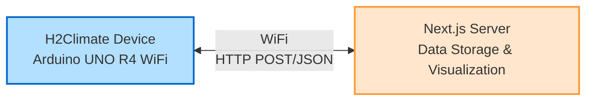
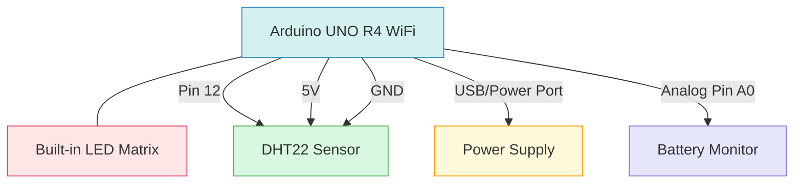
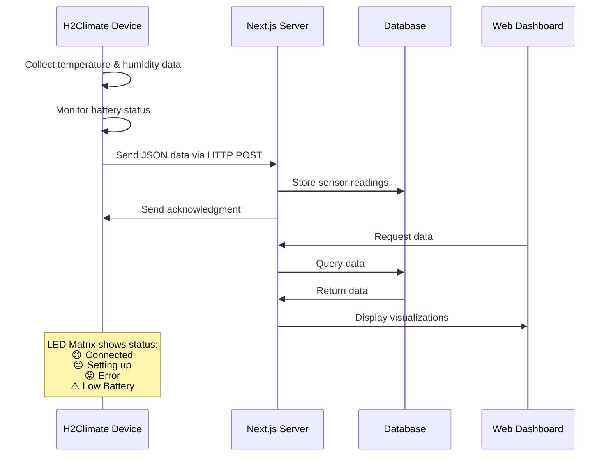
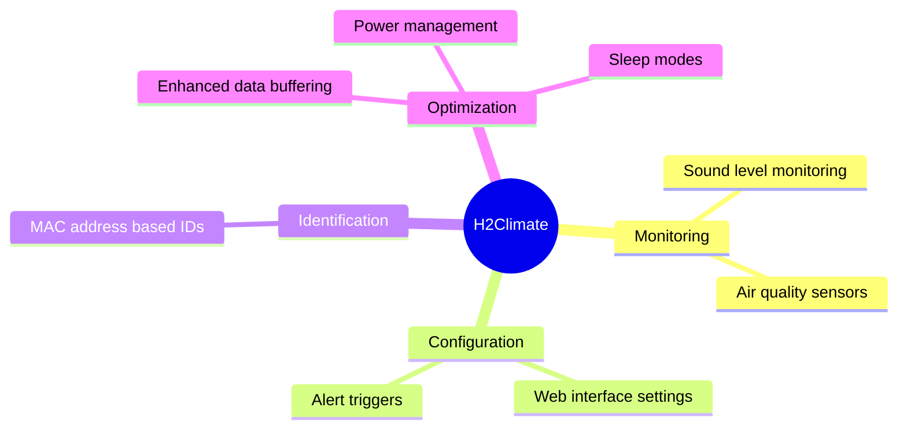
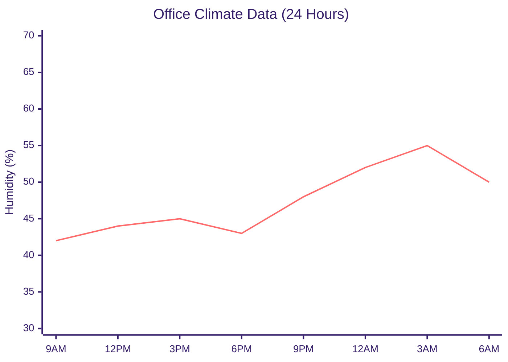

# Office Climate Monitor (H2Climate)

<div align="center">
  <!-- Image will be added later -->
  <p><em>Monitor and optimize your office environment with real-time temperature and humidity tracking</em></p>
</div>

## 📊 Overview

H2Climate is an Arduino-based IoT device that monitors environmental conditions in office spaces. It collects temperature and humidity data and sends it to a server for analysis and visualization. The device features a built-in LED matrix that displays status information using simple emoji-like faces.

### Key Features

- 🌡️ Real-time temperature monitoring with DHT22 sensor
- 💧 Humidity tracking with precision readings
- 🔋 Battery monitoring with voltage tracking and time estimation
- 🔄 Automatic data synchronization with configurable intervals
- 📶 WiFi connectivity with auto-reconnection
- 🕰️ NTP time synchronization for accurate timestamps
- 😊 Visual status indicators using built-in LED matrix
- 🔄 OTA (Over-The-Air) firmware updates
- 📊 Data buffering for reliable transmission
- 🚨 Comprehensive error handling and status reporting
- 🆔 MAC-based unique device identification

## 📈 Project Status

Check out our [Project Status](project_status.md) document for detailed information about:

- Learning objectives implementation
- Project statistics
- Current features
- Next steps
- Development progress

## 📐 System Architecture



## 🛠️ Hardware Components

- Arduino UNO R4 WiFi
- DHT22 Temperature & Humidity Sensor
- LED Matrix (built into UNO R4)
- Battery monitoring circuit
- Power supply

### Hardware Connections



## 📦 Software Components

The firmware (v0.7.2) has been organized into a modular architecture for improved maintainability:

### Core Components

- **DisplayManager**: Controls the LED matrix display for visual status feedback
- **NetworkManager**: Manages WiFi connectivity, API communications, and OTA updates
- **SensorManager**: Interfaces with DHT22 temperature and humidity sensors
- **BatteryMonitor**: Monitors battery voltage and estimates remaining time
- **DeviceIdentifier**: Generates and manages unique device identifiers based on MAC address

### Utilities

- **FancyLog**: Provides advanced logging functionalities with level-based formatting
- **DeviceIdentifier**: Manages device identity and MAC address-based identification

## 📦 Software Dependencies

- ArduinoJson (v6.x)
- TimeLib
- WiFiS3
- DHT sensor library
- Arduino_LED_Matrix
- ArduinoOTA

## 🔧 Installation & Setup

### Hardware Setup

1. Connect the DHT22 sensor to pin 12 on the Arduino UNO R4
2. Connect the battery monitoring circuit to analog pin A0
3. Power the Arduino via USB or external power supply

### Software Setup

1. Clone this repository:

   ```bash
   git clone https://github.com/yourusername/office-clima-device.git
   cd office-clima-device
   ```

2. Create a `secrets.h` file in the `/H2Climate_v0.7.2_uno_r4/src/config/` directory with your WiFi credentials:

   ```cpp
   #ifndef SECRETS_H
   #define SECRETS_H

   // WiFi Credentials - replace with your network information
   #define WIFI_SSID "your_wifi_ssid"
   #define WIFI_PASS "your_wifi_password"

   #endif // SECRETS_H
   ```

3. Update server settings in `Config.h` if needed:

   ```cpp
   constexpr const char* SERVER_URL = "your_server_url_or_ip";
   constexpr const int SERVER_PORT = 3000;
   ```

4. Upload the code to your Arduino using the Arduino IDE or PlatformIO

## 📈 Data Flow



## 🚀 Version History

| Version | Features                                                       |
| ------- | -------------------------------------------------------------- |
| v0.1    | Basic temperature and humidity monitoring                      |
| v0.2    | Added WiFi connectivity and data transmission                  |
| v0.3    | Implemented NTP time synchronization                           |
| v0.4    | Added LED matrix status indicators and improved error handling |
| v0.5    | Implemented battery monitoring                                 |
| v0.6    | Added OTA update capability                                    |
| v0.7.1  | Improved data buffering and error handling                     |
| v0.7.2  | Enhanced battery monitoring, improved display animations       |

## 📝 Future Improvements



## 📊 Web Dashboard

<!-- Dashboard image will be added later -->

The companion web dashboard displays:

- Current temperature and humidity readings
- Historical data trends
- Device status and connectivity information
- Battery status and remaining time
- Alert notifications for out-of-range conditions

### Sample Temperature & Humidity Trends



## 📡 API Endpoints

The device communicates with the following API endpoints:

- `/api/devices/readings` - POST endpoint for sending sensor data
- `/api/device/register` - POST endpoint for device registration
- `/api/device/update` - GET endpoint for checking firmware updates

## 🔌 Communication Protocol

Data is sent using JSON packets:

```json
{
  "deviceId": "6fe26f8eaf1e",
  "temperature": 23.5,
  "humidity": 45.2,
  "batteryVoltage": 3.7,
  "batteryPercentage": 85,
  "batteryTimeRemaining": 120,
  "timestamp": 1649276543
}
```
