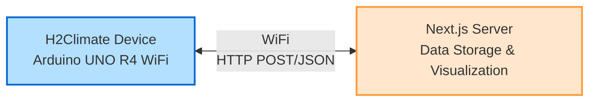
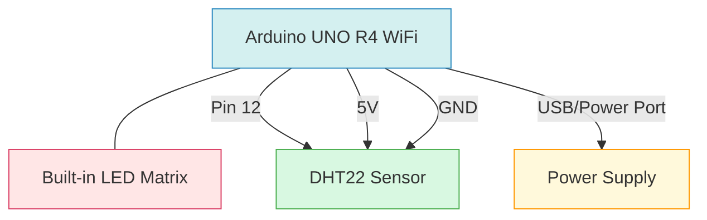
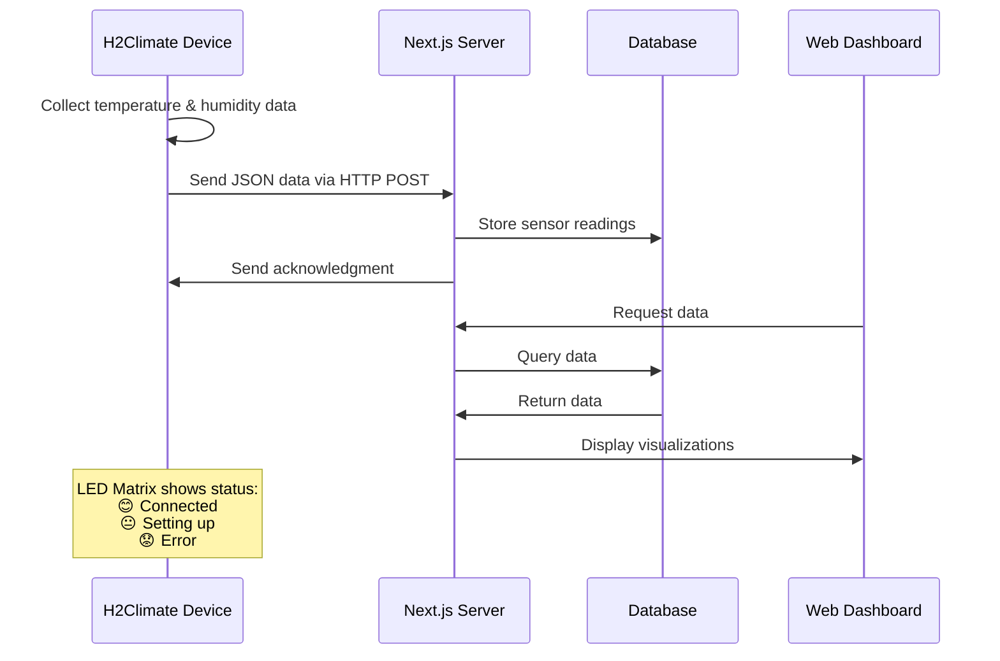
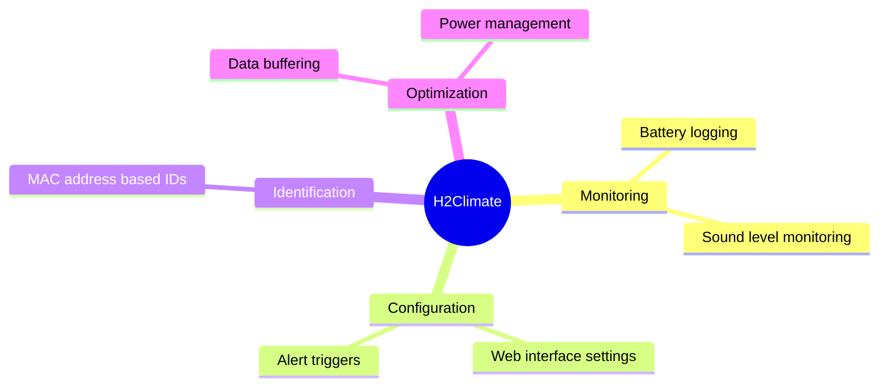
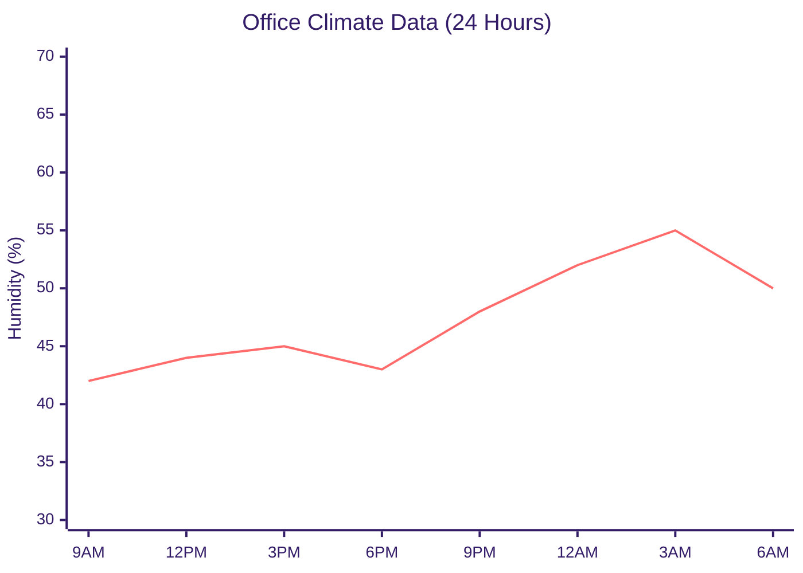

# Office Climate Monitor (H2Climate)

<div align="center">
  <!-- Image will be added later -->
  <p><em>Monitor and optimize your office environment with real-time temperature and humidity tracking</em></p>
</div>

## 📊 Overview

H2Climate is an Arduino-based IoT device that monitors environmental conditions in office spaces. It collects temperature and humidity data and sends it to a server for analysis and visualization. The device features a built-in LED matrix that displays status information using simple emoji-like faces.

### Key Features

- 🌡️ Real-time temperature monitoring
- 💧 Humidity tracking
- 🔄 Automatic data synchronization
- 📶 WiFi connectivity
- 🕰️ NTP time synchronization
- 😊 Visual status indicators using LED matrix
- 🔋 Low-power operation (planned)

## 📐 System Architecture



## 🛠️ Hardware Components

- Arduino UNO R4 WiFi
- DHT22 Temperature & Humidity Sensor
- LED Matrix (built into UNO R4)
- Power supply

### Hardware Connections



## 📦 Software Dependencies

- ArduinoJson
- TimeLib
- WiFiS3
- DHT sensor library
- Arduino_LED_Matrix

## 🔧 Installation & Setup

### Hardware Setup

1. Connect the DHT22 sensor to pin 12 on the Arduino UNO R4
2. Power the Arduino via USB or external power supply

### Software Setup

1. Clone this repository:

   ```bash
   git clone https://github.com/yourusername/office-clima-device.git
   cd office-clima-device
   ```

2. Create a `secrets.h` file in the project directory with your WiFi credentials:

   ```cpp
   #define WIFI_SSID "your_wifi_ssid"
   #define WIFI_PASS "your_wifi_password"
   ```

3. Modify `params.h` with your specific device settings:

   ```cpp
   #define DEVICE_ID "your_unique_device_id"
   #define SERVER_URL "your_server_url_or_ip"
   #define SERVER_PORT 3000
   ```

4. Upload the code to your Arduino using the Arduino IDE or PlatformIO

## 📈 Data Flow



## 🚀 Version History

| Version | Features                                                       |
| ------- | -------------------------------------------------------------- |
| v0.1    | Basic temperature and humidity monitoring                      |
| v0.2    | Added WiFi connectivity and data transmission                  |
| v0.3    | Implemented NTP time synchronization                           |
| v0.4    | Added LED matrix status indicators and improved error handling |

## 📝 Future Improvements



## 📊 Web Dashboard

<!-- Dashboard image will be added later -->

The companion web dashboard displays:

- Current temperature and humidity readings
- Historical data trends
- Device status and connectivity information
- Alert notifications for out-of-range conditions

### Sample Temperature & Humidity Trends



## 📡 API Endpoints

The device communicates with the following API endpoints:

- `/api/devices/readings` - POST endpoint for sending sensor data
- `/api/device/register` - POST endpoint for device registration

## 🔌 Communication Protocol

Data is sent using simple JSON packets:

```json
{
  "deviceId": "6fe26f8eaf1e",
  "temperature": 23.5,
  "humidity": 45.2,
  "timestamp": 1649276543
}
```

## ⚙️ Troubleshooting

- **Device shows sad face**: Check WiFi connection or sensor wiring
- **No data on server**: Verify server URL and port in params.h
- **Incorrect timestamps**: Check NTP server configuration

## 📄 License

This project is licensed under the MIT License - see the LICENSE file for details.

## 👥 Contributors

- [Your Name](https://github.com/yourusername)

## 🙏 Acknowledgements

- [Arduino Team](https://www.arduino.cc/) for the excellent hardware and libraries
- [Next.js](https://nextjs.org/) for the server framework
