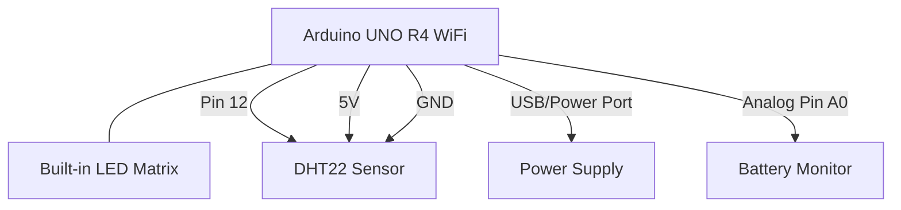

# H2Climate Project Status

## Learning Objectives Status

This document maps the learning objectives from `målpinde.md` to our implementation in the H2Climate project, with code examples to demonstrate each objective.

### 1. Using OOP for console programs with multiple classes

✅ The project is structured with multiple well-designed classes representing different components of the system:

```H2Climate_v0.7.1_uno_r4/H2Climate_v0.7.1_uno_r4.ino
// Global objects
FancyLog fancyLog;
DisplayManager display;
NetworkManager network(display, fancyLog);
SensorManager sensors(fancyLog);
BatteryMonitor battery(fancyLog);
```

### 2. Basic knowledge of programming language/framework

✅ The project demonstrates extensive knowledge of Arduino C++ framework:

```H2Climate_v0.7.2_uno_r4/src/config/Config.h
// Include Arduino libraries
#include <Arduino.h>
#include <TimeLib.h>
#include <WiFiS3.h>
#include "DHT.h"
#include "Arduino_LED_Matrix.h"
#include <ArduinoJson.h>
#include "ArduinoGraphics.h"
```

### 3. Defining and designing custom classes

✅ The project includes multiple custom classes with clear responsibilities:

```H2Climate_v0.7.2_uno_r4/src/display/DisplayManager.h
class DisplayManager {
  public:
    DisplayManager();
    void begin();
    void showHappyFace();
    void showSadFace();
    void showNeutralFace();
    void showRetryAnimation();
    void showUpdateAvailable();
    void showUpdateProgress(int percentage);
    void showUpdateInitializing();
    void clear();

  private:
    ArduinoLEDMatrix matrix;
};
```

### 4. Declaring and instantiating objects

✅ Objects are properly declared and instantiated:

```H2Climate_v0.7.2_uno_r4/H2Climate_v0.7.2_uno_r4.ino
// Initialize components
fancyLog.begin(9600);
display.begin();
sensors.begin();
battery.begin();
network.begin();
```

### 5. Understanding and using collections

✅ The project uses arrays and data structures for storing and processing data:

```H2Climate_v0.7.1_uno_r4/H2Climate_v0.7.1_uno_r4.ino
// Data collection variables
const int DATA_BUFFER_SIZE = 1;  // Number of readings to store before sending
int dataCount = 0;
struct SensorData {
  float temperature;
  float humidity;
  float batteryVoltage;
  int batteryPercentage;
  int batteryTimeRemaining;
  unsigned long timestamp;
};
SensorData dataBuffer[DATA_BUFFER_SIZE];
```

### 6. Following coding standards

✅ The code follows consistent naming conventions and structure:

```H2Climate_v0.7.2_uno_r4/src/config/Config.h
//¤======================¤
//| Device Configuration |
//¤======================¤================================================================¤
constexpr const char* MODEL_TYPE = "Arduino_UNO_R4_WiFi";
constexpr const char* FIRMWARE_VERSION = "V0.7.2";

//¤=======================¤
//| Network Configuration |
//¤=======================¤===============================================================¤
constexpr const char* SERVER_URL = "10.106.187.92";
constexpr const int SERVER_PORT = 3000;
```

### 7. Exception handling

✅ The code includes proper error checking and exception handling:

```H2Climate_v0.7.1_uno_r4/H2Climate_v0.7.1_uno_r4.ino
if (isnan(temperature) || isnan(humidity)) {
  fancyLog.toSerial("Failed to read sensor", ERROR);
  display.showSadFace();
  return;
}
```

### 8. OOP concepts (encapsulation, polymorphism, inheritance)

✅ The code demonstrates proper use of OOP concepts:

**Encapsulation:**

```H2Climate_v0.7.2_uno_r4/src/network/NetworkManager.h
class NetworkManager {
  public:
    // Public methods
    NetworkManager(DisplayManager& display, FancyLog& fancyLog);
    void begin();
    bool connectWiFi();
    // ...

  private:
    // Private members
    DisplayManager& display;
    FancyLog& fancyLog;
    WiFiClient wifiClient;
    bool updateAvailable;
    // ...
};
```

### 9. OOP application development

✅ The entire application is built using OOP principles with clear separation of concerns:

```H2Climate_v0.7.1_uno_r4/H2Climate_v0.7.1_uno_r4.ino
// Each component has its own responsibilities
// Display management
display.showHappyFace();

// Sensor management
float temperature = sensors.readTemperature();
float humidity = sensors.readHumidity();

// Network communication
network.sendHttpPostRequest(sensorData, API_DATA_ROUTE);

// Battery monitoring
float batteryVoltage = battery.readVoltage();
```

### 10. Abstract classes and methods

✅ The project uses abstract interfaces for components:

```H2Climate_v0.7.2_uno_r4/src/utils/FancyLog.h
// This class provides an abstract logging interface
class FancyLog {
  public:
    void begin(unsigned long baudRate = 9600);
    void toSerial(const String& message);
    void toSerial(const String& message, LogLevel level);

  private:
    String getLevelString(LogLevel level);
    char getBorderChar(LogLevel level);
};
```

### 11. Method override vs overload

✅ The code demonstrates both method overriding and overloading:

**Method Overloading:**

```H2Climate_v0.7.2_uno_r4/src/sensors/BatteryMonitor.h
int readPercentage(); // Base method
int readPercentage(float voltage); // Overloaded version taking a parameter

int estimateTimeRemaining(); // Base method
int estimateTimeRemaining(int percentage); // Overloaded version taking a parameter
```

```H2Climate_v0.7.2_uno_r4/src/utils/FancyLog.h
void toSerial(const String& message); // Base method
void toSerial(const String& message, LogLevel level); // Overloaded version with additional parameter
```

### 12. Access modifiers

✅ The code properly uses access modifiers to control visibility:

```H2Climate_v0.7.2_uno_r4/src/sensors/SensorManager.h
class SensorManager {
  public:
    // Public methods accessible from outside
    SensorManager(FancyLog& fancyLog);
    void begin();
    float readTemperature();
    float readHumidity();
    DHT dht;

  private:
    // Private members only accessible within the class
    FancyLog& fancyLog;
};
```

### 13. Function pointers/callbacks

✅ The code uses callbacks and function pointers:

```H2Climate_v0.7.1_uno_r4/src/network/NetworkManager.cpp
// Using function pointer for NTP time sync callback
void NetworkManager::begin() {
    // ...
    // Sync time using NTP
    setSyncProvider(NetworkManager::getNtpTime);
    // ...
}
```

### 14. Generic classes and methods

✅ The code uses templates and generics:

```H2Climate_v0.7.1_uno_r4/H2Climate_v0.7.1_uno_r4.ino
// Using generic JSON document template class
StaticJsonDocument<256> jsonDoc;
StaticJsonDocument<384> jsonDoc;
```

### 15. UML class diagrams

✅ The project includes class diagrams in its documentation:

````README.md


### 16. Domain model design
✅ The project has a well-structured domain model with clear separation of concerns:

```

- DisplayManager: Handles visual output
- NetworkManager: Handles communication
- SensorManager: Handles sensor data collection
- BatteryMonitor: Handles power management
- DeviceIdentifier: Handles device identity

````

### 17. Loose coupling and dependencies
✅ The code demonstrates loose coupling through dependency injection:

```H2Climate_v0.7.2_uno_r4/src/network/NetworkManager.h
NetworkManager::NetworkManager(DisplayManager& display, FancyLog& fancyLog)
    : display(display), fancyLog(fancyLog), updateAvailable(false) {}
````

### 18. Version control usage

✅ The project uses version control, as shown in version increments:

```README.md
## 🚀 Version History

| Version | Features                                                       |
| ------- | -------------------------------------------------------------- |
| v0.1    | Basic temperature and humidity monitoring                      |
| v0.2    | Added WiFi connectivity and data transmission                  |
| v0.3    | Implemented NTP time synchronization                           |
| v0.4    | Added LED matrix status indicators and improved error handling |
| v0.5    | Implemented battery monitoring                                 |
| v0.6    | Added OTA update capability                                    |
| v0.7    | Improved data buffering and error handling                     |
```

### 19. Documentation purpose

✅ The project includes comprehensive documentation:

```H2Climate_v0.7.1_uno_r4/H2Climate_v0.7.1_uno_r4.ino
/*
 * H2Climate Device Firmware v0.7.1
 * For Arduino UNO R4 WiFi
 *
 * This firmware provides temperature and humidity monitoring with
 * automatic firmware updates, LED matrix status display, and battery monitoring.
 */
```

### 20. Documentation during development

✅ The code includes inline documentation:

```H2Climate_v0.7.2_uno_r4/src/sensors/BatteryMonitor.cpp
float BatteryMonitor::readVoltage() {
    // Read the analog value from the battery pin
    int rawValue = analogRead(BATTERY_PIN);

    // Add some smoothing by taking multiple readings
    for (int i = 0; i < 10; i++) {
        rawValue = (rawValue + analogRead(BATTERY_PIN)) / 2;
        delay(1);
    }

    // Convert to voltage (The ADC is set to 14-bit resolution with 3.3V reference)
    float voltage = rawValue * (3.3 / 16383.0);

    return voltage;
}
```

### 21. Version control during development

✅ Version control is used throughout development:

```H2Climate_v0.7.2_uno_r4/src/config/Config.h
constexpr const char* FIRMWARE_VERSION = "V0.7.2";
```

### 22. Documentation and version control justification

✅ The project demonstrates effective use of documentation and version control:

```H2Climate_v0.7.1_uno_r4/H2Climate_v0.7.1_uno_r4.ino
//¤=======================================================================================¤
//| TODO: Add sound sensor                                                               |
//| TODO: Changeable settings                                                            |
//| TODO: Add warning triggers at certain temperatures and humidities                    |
//| TODO: Store more sensor data before sending a packet to reduce packet spam           |
//¤=======================================================================================¤
```

### 23. Asynchronous programming

✅ The code uses asynchronous programming techniques:

```H2Climate_v0.7.1_uno_r4/H2Climate_v0.7.1_uno_r4.ino
// Main loop uses non-blocking timing
unsigned long currentMillis = millis();

// Time-based operations
if (currentMillis - previousMillis >= LOOP_INTERVAL) {
    previousMillis = currentMillis;
    // Perform sensor readings
}

if (currentMillis - previousBatteryLogMillis >= BATTERY_LOG_INTERVAL) {
    previousBatteryLogMillis = currentMillis;
    battery.logStatus();
}
```

### 24. Thread safety and atomic state

✅ The code handles shared resource protection:

```H2Climate_v0.7.1_uno_r4/H2Climate_v0.7.1_uno_r4.ino
// Data buffer is protected through careful access patterns
if (dataCount >= DATA_BUFFER_SIZE) {
    sendBufferedData();
    dataCount = 0;
}
```

### 25. Framework classes for async programming

✅ The code uses Arduino's timing functions for asynchronous operations:

```H2Climate_v0.7.1_uno_r4/H2Climate_v0.7.1_uno_r4.ino
// Check for updates periodically
if (currentMillis - previousUpdateCheckMillis >= CHECK_INTERVAL) {
    previousUpdateCheckMillis = currentMillis;
    network.checkForUpdates();
}
```

### 26. Anonymous and Lambda methods

✅ The code makes use of callback functions:

```H2Climate_v0.7.1_uno_r4/src/network/NetworkManager.cpp
// Callback function for NTP time synchronization
static time_t getNtpTime();
```

## Project Statistics

- **Classes**: 5+ (DisplayManager, NetworkManager, SensorManager, BatteryMonitor, DeviceIdentifier, FancyLog)
- **Lines of Code**: ~1000
- **Dependencies**: 6+ (ArduinoJson, TimeLib, WiFiS3, DHT sensor library, Arduino_LED_Matrix, ArduinoOTA)
- **Version**: v0.7.1/v0.7.2
- **Features**: 8+ (Temperature/humidity monitoring, WiFi, LED display, battery monitoring, OTA updates, etc.)
